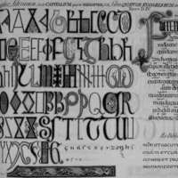

# Título 1
## Título 1.1
## Título 1.2
---
**Texto texto texto Texto texto texto**

__Texto texto texto Texto texto texto__

__**Texto texto texto Texto texto texto**__

_Texto texto texto Texto texto texto_

### Lista
- item
- item
- item

```
Texto texto texto Texto texto texto

Texto texto texto Texto texto texto
```

Texto texto texto Texto texto texto

Texto texto texto Texto texto texto

[Link para uma página](https://programminghistorian.org/pt/licoes/introducao-ao-markdown)



